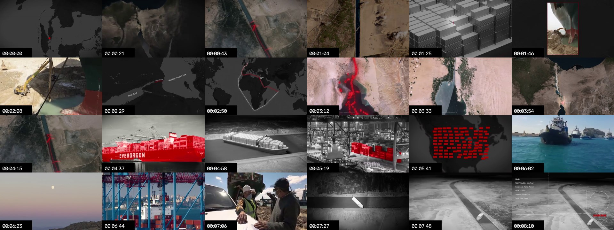
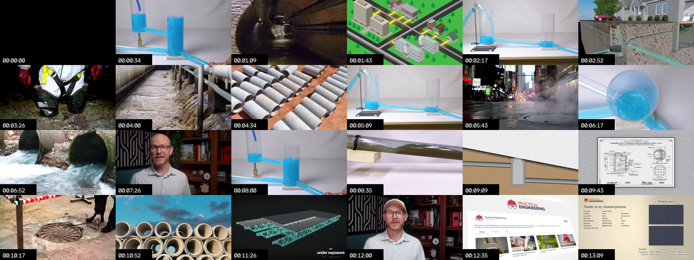
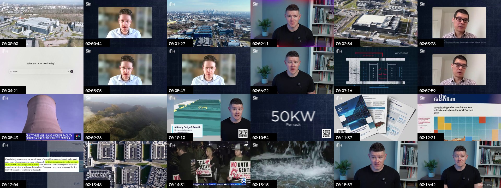
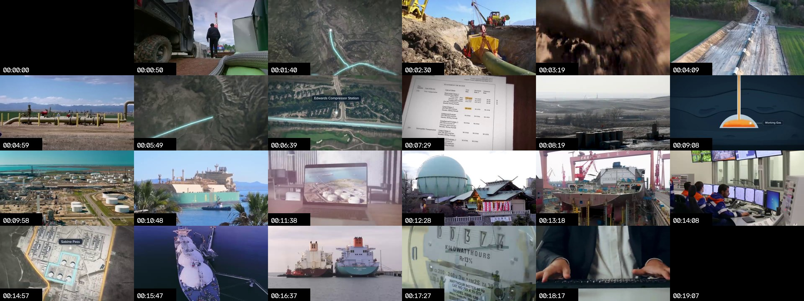

# Auditoria de edição — Hidden Systems Lab

## Objetivo

Transformar quatro referências de alto nível em um sistema de edição próprio, automatizável e adequado a um canal sem apresentador:

- Practical Engineering: clareza causal e demonstração física;
- neo: mapas, escala geográfica e continuidade espacial;
- The B1M: intensidade documental, variedade de evidências e abertura forte;
- Wendover Productions: jornadas logísticas completas e encadeamento econômico.

O objetivo não é reproduzir a identidade de qualquer canal. É identificar os princípios que funcionam, eliminar o que depende de apresentador ou edição artesanal e convertê-los em regras executáveis por Remotion, geração de vídeo e seleção automatizada de assets.

## Escopo e metodologia

Foram baixadas cópias de análise de oito vídeos, totalizando 127,6 minutos e 427 MB. Extraímos:

- transcrições e metadados;
- 1.083 segmentos visuais detectados;
- duração média e mediana dos planos;
- frequência de cortes no primeiro minuto e no corpo;
- folhas de contato do episódio inteiro e dos primeiros 60 segundos;
- velocidade aproximada de narração;
- loudness, faixa dinâmica e pico do arquivo analisado;
- padrões de uso de mapas, B-roll, apresentador, arquivos, diagramas e evidências.

O detector mede mudanças de conteúdo e cortes suficientemente fortes. Uma animação contínua de mapa pode permanecer como um único plano detectado, mesmo que contenha diversos beats internos. Portanto, os números devem ser interpretados junto com as folhas de contato.

### Amostra analisada

| Canal | Vídeo | Duração |
|---|---|---:|
| neo | [How One Ship Caused a Global Traffic Jam](https://www.youtube.com/watch?v=8RxmRw1kCrc) | 8,2 min |
| neo | [California's Water Problem](https://www.youtube.com/watch?v=I821oI3Ezjs) | 9,5 min |
| Practical Engineering | [What's Inside a Manhole?](https://www.youtube.com/watch?v=1ztGpGjO60o) | 13,2 min |
| Practical Engineering | [Which Power Plant Does My Electricity Come From?](https://www.youtube.com/watch?v=sH1PVVJuBtE) | 23,3 min |
| The B1M | [Dubai Has a $22 Billion Plumbing Problem](https://www.youtube.com/watch?v=0CWb9CVPShM) | 15,6 min |
| The B1M | [Powering The Internet is Becoming a Big Problem](https://www.youtube.com/watch?v=sLEnn-sgpIk) | 16,7 min |
| Wendover Productions | [The Logistics of Natural Gas](https://www.youtube.com/watch?v=HuMxQzX0uso) | 19,1 min |
| Wendover Productions | [How Inland Waterways Work](https://www.youtube.com/watch?v=Uqs-f862YaU) | 22,1 min |

## Resultado quantitativo

| Canal/vídeo | Cenas detectadas | Cortes no 1º min | Plano médio | Plano mediano | Narração aprox. |
|---|---:|---:|---:|---:|---:|
| neo — Suez | 38 | 2 | 12,9 s | 9,1 s | 133 ppm |
| neo — água | 56 | 7 | 10,2 s | 7,3 s | 134 ppm |
| Practical — manhole | 112 | 13 | 7,1 s | 5,3 s | 207 ppm |
| Practical — power grid | 133 | 5 | 10,5 s | 7,1 s | 209 ppm |
| The B1M — Dubai | 187 | 24 | 5,0 s | 2,9 s | 165 ppm |
| The B1M — data centers | 206 | 25 | 4,9 s | 3,9 s | 159 ppm |
| Wendover — natural gas | 147 | 24 | 7,8 s | 3,6 s | 214 ppm |
| Wendover — waterways | 204 | 5 | 6,5 s | 3,5 s | 219 ppm |

### O que os números realmente significam

1. **The B1M usa uma abertura de alta densidade.** Os dois vídeos apresentam 24–25 cortes detectados no primeiro minuto. Depois, a cadência cai para aproximadamente 11 cortes por minuto. A abertura funciona como um trailer factual: problema, escala, contraste, evidência e rosto do host.

2. **neo parece lento no detector, mas não visualmente.** Seus mapas podem permanecer por 15–30 segundos enquanto câmera, rota, rótulos, escala e destaque mudam. É o modelo mais próximo do que podemos industrializar em Remotion sem criar aparência de slideshow.

3. **Wendover intercala rajadas e planos longos.** A mediana dos planos fica perto de 3,5 segundos, embora a média seja 6,5–7,8 segundos. Isso revela uma distribuição assimétrica: vários inserts rápidos e alguns mapas ou explicações bem mais longos.

4. **Practical Engineering usa o apresentador como cola.** Quando a edição precisa desacelerar, o rosto do host preserva continuidade e confiança. Como o Hidden Systems Lab não terá apresentador, essa função precisa ser substituída por mapa persistente, objeto-guia, reconstrução consistente e fontes visíveis.

5. **Velocidade não é sinônimo de retenção.** O conteúdo com mapas mais densos trabalha perto de 133 palavras por minuto; os vídeos com host e montagem logística chegam a mais de 200. Para nosso formato, a faixa inicial mais segura é 145–165 palavras por minuto, deixando espaço cognitivo para o espectador ler mapas e acompanhar mecanismos.

## Análise por referência

### neo — espaço antes de espetáculo



O neo estabelece um mundo espacial contínuo. O espectador raramente perde a noção de onde está. Um mapa-mãe introduz a situação; a câmera aproxima o ponto relevante; imagens de satélite ou material real confirmam; depois o vídeo retorna ao mapa.

**O que adotar**

- um mapa ou esquema persistente como espinha dorsal;
- movimentos de câmera motivados pela narração;
- cor de destaque única para rota, objeto ou risco;
- labels curtos e hierarquia tipográfica rigorosa;
- transição por continuidade espacial, não por efeito decorativo;
- retorno periódico ao mapa completo para reorientar.

**O que não copiar**

- paleta escura e vermelho como combinação idêntica;
- abertura excessivamente lenta quando o assunto não tem tensão própria;
- dependência quase total de Google Earth ou imagens de satélite.

**Tradução para Remotion**

Uma composição `WorldToMechanism` precisa permitir:

1. mapa global;
2. rota principal;
3. aproximação geográfica;
4. mudança de satélite para diagrama;
5. highlight de um componente;
6. retorno ao contexto global.

Cada estado pode durar 3–6 segundos dentro de uma mesma sequência de 18–30 segundos. Não é necessário cortar sempre; é necessário mudar o estado informacional.

### Practical Engineering — mecanismo antes de decoração



Practical Engineering começa com uma pergunta cotidiana, revela a complexidade escondida e usa uma demonstração física para tornar o mecanismo inevitavelmente compreensível. O vídeo sobre manholes alterna túnel real, apresentador, modelo transparente, ilustrações e documentação técnica.

**O que adotar**

- explicar primeiro a função, depois o componente;
- usar falhas, pressão, gravidade ou gargalos para criar conflito;
- construir um modelo visual que se transforma conforme a explicação;
- apresentar causa e consequência na mesma composição;
- voltar ao objeto cotidiano no final.

**O que precisa ser substituído**

- apresentador → objeto-guia, voz consistente e mapa persistente;
- demonstração de bancada → simulação Remotion ou reconstrução generativa controlada;
- visita física → imagens reais licenciadas, press kits, arquivos públicos ou IA claramente identificada;
- gestos do apresentador → setas, tracking, recorte de detalhe e mudança de escala.

**Componente central**

`MechanismLab` deve receber entradas, saídas, estados e falhas. Exemplo para esgoto:

`casa → ramal → coletor → poço de visita → estação elevatória → tratamento`

O componente não aparece inteiro de uma vez. Cada etapa é ativada quando entra na narração; o restante permanece visível em baixa intensidade.

### The B1M — energia editorial e prova



The B1M mistura host, drone, arquivo, entrevistas, manchetes, mapas, diagramas e números. Sua vantagem não é um único estilo visual: é a rápida alternância entre tipos de evidência.

**O que adotar**

- abrir mostrando consequência antes da explicação;
- alternar problema, escala e prova no primeiro minuto;
- usar documentos e reportagens como evidência visual;
- destacar um número por vez;
- inserir depoimento ou fonte institucional quando aumenta autoridade;
- criar mudança de energia entre capítulos.

**O que evitar**

- 24–25 cortes por minuto como padrão de todo o vídeo;
- reproduzir material jornalístico sem licença ou procedência;
- telas verticais e capturas aleatórias usadas apenas para gerar movimento;
- humor ou personalidade dependentes de host.

Para o Hidden Systems Lab, a densidade do The B1M deve ficar concentrada nos primeiros 35–50 segundos e em momentos de virada. O restante precisa respirar o suficiente para que diagramas sejam entendidos.

### Wendover Productions — cadeia completa



Wendover organiza o episódio como uma sequência de restrições: origem, distância, transporte, armazenamento, economia, risco e destino. Mesmo quando usa B-roll, a imagem quase sempre representa o substantivo ou o processo que está sendo explicado.

**O que adotar**

- jornada ponta a ponta;
- pergunta econômica junto da pergunta física;
- alternância entre escala continental e detalhe operacional;
- uso de gargalos para mover a história;
- retomada de elementos apresentados no começo;
- mapas como mecanismo narrativo, não decoração.

**O que evitar**

- narração acima de 200 palavras por minuto em temas tecnicamente densos;
- stock footage genérico sem conexão causal;
- capítulos patrocinados que interrompem a lógica do episódio;
- sobrecarga de fatos sem pausa para síntese.

## A linguagem própria do Hidden Systems Lab

Nossa combinação recomendada é:

| Camada | Referência dominante | Função no canal |
|---|---|---|
| Abertura | The B1M | Problema, consequência e escala |
| Espaço | neo | Localização, rota e orientação |
| Mecanismo | Practical Engineering | Causa, funcionamento e falha |
| Jornada | Wendover | Origem, transformação e destino |
| Diferencial próprio | Hidden Systems Lab | Reconstrução IA, fontes visíveis e sistema sem apresentador |

### Mix visual recomendado

Para um episódio normal:

- 42% Remotion: mapas, fluxos, mecanismos, números e comparações;
- 30% material real: drone, instalações, arquivo, press kits e imagens licenciadas;
- 15% vídeo generativo: reconstrução, interior impossível, passado e transições de escala;
- 8% evidência documental: relatórios, mapas oficiais, manchetes e documentos;
- 5% tipografia, bumpers e transições.

Esses percentuais são uma distribuição editorial, não uma sequência fixa. Nunca devemos montar um padrão mecânico do tipo “Remotion → IA → imagem real” a cada 15 segundos.

## Arquitetura recomendada para um episódio de 14 minutos

| Tempo | Função | Visual dominante |
|---|---|---|
| 00:00–00:18 | Consequência intrigante | cena real ou generativa + som físico |
| 00:18–00:42 | Paradoxo e escala | montagem rápida + número + mapa |
| 00:42–01:10 | Promessa do episódio | mapa completo do sistema |
| 01:10–02:45 | Origem | real + `OriginMap` |
| 02:45–04:40 | Primeira transformação | `MechanismLab` + macro IA |
| 04:40–06:35 | Transporte | `FlowTrace` + cenas reais |
| 06:35–08:20 | Gargalo invisível | evidência + `ConstraintDiagram` |
| 08:20–10:10 | Armazenamento ou transferência | corte transversal + reconstrução |
| 10:10–11:55 | Entrega final | material real + rota final |
| 11:55–13:10 | Falha em cascata | `FaultTree` + aceleração sonora |
| 13:10–14:00 | Síntese e retorno | mapa completo + callback inicial |

## Gramática de planos

| Tipo | Duração típica | Regra interna |
|---|---:|---|
| Cold-open real/IA | 3–7 s | apresentar consequência, não contexto completo |
| Mapa de jornada | 15–30 s | novo estado informacional a cada 3–5 s |
| Diagrama de mecanismo | 10–24 s | uma variável ou componente novo por beat |
| B-roll real | 3–6 s | deve provar substantivo, escala ou ação narrada |
| Cena generativa | 4–8 s | máximo normal de 12 s; nunca servir como prova |
| Documento/evidência | 4–9 s | destacar apenas a linha que sustenta a afirmação |
| Número principal | 3–6 s | um número, unidade, comparação e fonte |
| Plano de respiração | 3–5 s | ambiente e som diegético antes de novo capítulo |

### Cadência

- abertura: 15–20 beats visuais nos primeiros 45 segundos;
- corpo: 7–11 mudanças fortes por minuto;
- mecanismo complexo: plano longo permitido, mas com beats internos;
- máximo de duas cenas generativas consecutivas;
- após 25–40 segundos de abstração, inserir evidência real ou documental;
- reorientar no mapa completo a cada 2–3 minutos.

## Biblioteca Remotion necessária

### Fundação

- `EpisodeShell`
- `SafeArea`
- `SourceRegistry`
- `ColorTokens`
- `TypographyTokens`
- `CameraRig2D`
- `AudioBus`

### Mapas e jornadas

- `WorldToLocalMap`
- `FlowTrace`
- `RouteMilestones`
- `NetworkPulse`
- `OriginDestination`
- `MapReorientation`

### Mecanismos

- `MechanismLab`
- `CrossSection`
- `LayerStack`
- `InputOutputFlow`
- `PressureState`
- `CapacityGauge`
- `FaultTree`
- `FailureCascade`

### Evidência

- `EvidenceCard`
- `DocumentHighlight`
- `SourceLowerThird`
- `MetricProof`
- `QuoteWithContext`
- `UncertaintyLabel`
- `AIReconstructionLabel`

### Estrutura editorial

- `ColdOpenMontage`
- `QuestionCard`
- `ChapterTransition`
- `ComparisonSplit`
- `BeforeAfter`
- `ConclusionMap`
- `EndCallback`

O Remotion permite parametrizar texto, imagens, cores, timing e layout em componentes reutilizáveis e renderizar vídeos de forma programática. Isso sustenta um design system real, desde que cada episódio receba dados e uma composição própria, em vez de apenas trocar texto num template único. [Documentação oficial do Remotion](https://www.remotion.dev/)

## Estrutura de dados por cena

```json
{
  "scene_id": "S042",
  "claim_id": "C018",
  "narrative_function": "explain_bottleneck",
  "truth_role": "explanation",
  "visual_mode": "remotion_mechanism_lab",
  "duration_seconds": 16,
  "voiceover": "...",
  "beats": [
    {"at": 0.0, "action": "show_system"},
    {"at": 3.2, "action": "activate_pump"},
    {"at": 7.0, "action": "increase_pressure"},
    {"at": 11.4, "action": "show_failure"}
  ],
  "source_url": "...",
  "asset_license": "licensed",
  "on_screen_text": "...",
  "audio_cue": "pressure_rise",
  "disclosure": null
}
```

`truth_role` deve aceitar apenas:

- `evidence`: material real ou documento verificável;
- `explanation`: diagrama ou visualização abstrata;
- `reconstruction`: cena gerada ou reconstituída;
- `atmosphere`: imagem que estabelece sensação, sem sustentar uma afirmação.

Isso impede que uma cena gerativa seja usada acidentalmente como comprovação factual.

## Direção de cenas geradas por IA

Cada episódio terá um `shot_bible` com:

- período e localização;
- clima e hora do dia;
- distância focal preferencial;
- movimento de câmera permitido;
- direção dominante do movimento;
- paleta e contraste;
- materiais e escala física;
- elementos proibidos;
- nível de realismo;
- imagem de referência para continuidade.

### Usos recomendados

- percurso dentro de tubulações;
- corte impossível por baixo de uma cidade;
- reconstrução histórica sem filmagem disponível;
- transformação entre mapa e instalação;
- macro de água, eletricidade, dados, gás ou combustível;
- atmosfera de risco ou escala.

### Usos proibidos

- fingir que uma reconstrução é filmagem documental;
- gerar logotipos, documentos ou medições como evidência;
- representar uma pessoa real praticando ação não documentada;
- usar 15 segundos de movimento sem mudança informacional;
- encadear várias cenas com arquitetura, clima ou direção incompatíveis.

O YouTube exige divulgação em certos casos de conteúdo sintético ou alterado que pareça realista. O pipeline deve preencher o campo de disclosure e preservar essa decisão até a publicação. [Política oficial do YouTube](https://support.google.com/youtube/answer/14328491?hl=en)

## Desenho sonoro

O som precisa unir imagens vindas de fontes diferentes. A mixagem deve possuir cinco buses:

1. voz;
2. música;
3. ambiente;
4. efeitos de mecanismo;
5. transições e impactos.

### Regras

- uma voz sintética licenciada e consistente;
- dicionário de pronúncia para nomes técnicos e geográficos;
- música contínua por capítulo, sem reiniciar a cada cena;
- ducking automático de 6–9 dB durante fala;
- som físico correspondente ao mecanismo: pressão, válvula, vibração, fluxo, relé, motor;
- transição sonora iniciada antes do corte visual quando houver mudança de escala;
- silêncio ou redução de música antes da principal revelação;
- master inicial entre -14 e -16 LUFS integrados e pico máximo de -1 dBTP;
- validação automática de clipping, silêncio não planejado e diferença excessiva entre capítulos.

Os valores medidos nos downloads variaram muito por causa de masterizações e encodes diferentes. Por isso, não devemos copiar o loudness de um canal; devemos manter um padrão próprio e consistente.

## Pipeline sem edição manual de timeline

```text
tema
  ↓
mapa de perguntas e fontes
  ↓
roteiro causal
  ↓
claims verificáveis
  ↓
plano de cenas em JSON
  ↓
seleção/geração de assets
  ↓
composições Remotion
  ↓
narrativa + música + SFX
  ↓
render de validação
  ↓
QA automático
  ↓
aprovar ou reconstruir
  ↓
master e publicação
```

Não há edição manual da timeline. A revisão humana funciona como aprovação ou rejeição. Quando uma cena falhar, altera-se o dado, prompt ou regra; o sistema renderiza novamente.

## Quality gates obrigatórios

### Pesquisa

- toda afirmação factual possui `claim_id` e fonte;
- números incluem ano, unidade e contexto;
- divergências entre fontes são registradas;
- nenhuma reconstrução é tratada como evidência.

### Roteiro

- pergunta central aparece até 42 segundos;
- mapa do sistema aparece até 70 segundos;
- cada capítulo termina com consequência ou nova restrição;
- não existem três parágrafos consecutivos sem mudança causal;
- velocidade de narração permanece na faixa definida.

### Visual

- nenhum asset abaixo da resolução mínima;
- ausência de texto cortado, overflow e colisão com legenda;
- no máximo duas cenas generativas consecutivas;
- imagens reais possuem procedência e licença;
- nenhum asset importante é repetido sem função de callback;
- mapas preservam orientação e escala coerentes;
- cena generativa realista recebe disclosure quando necessário.

### Áudio

- voz inteligível em todos os dispositivos simulados;
- pronúncias validadas;
- sem clipping;
- música não mascara consoantes;
- transições não excedem o pico permitido;
- ausência de lacunas não planejadas.

### Render

- detecção de frames pretos ou congelados;
- OCR para conferir textos e fontes;
- comparação do áudio renderizado com a duração do vídeo;
- validação de fps, resolução e espaço de cor;
- geração automática de proxy para revisão.

## Riscos estratégicos

### Aparência de conteúdo massificado

O risco não é usar IA ou Remotion. O risco é produzir vídeos repetitivos, com a mesma estrutura superficial, assets genéricos e pouca variação substantiva. O YouTube identifica conteúdo repetitivo ou produzido em massa como problema potencial para monetização. [Política de monetização do YouTube](https://support.google.com/youtube/answer/1311392?hl=en)

Mitigação:

- hero visual exclusivo por episódio;
- mapa específico e baseado em dados reais;
- biblioteca modular, não template único;
- fontes visíveis;
- argumento e mecanismo originais;
- QA de repetição entre episódios.

### Dependência de material de terceiros

The B1M e Wendover usam muito material real. Não devemos presumir que podemos reproduzir a mesma prática apenas porque o material está no YouTube.

Mitigação:

- press kits oficiais;
- acervos governamentais e domínio público quando aplicável;
- bibliotecas licenciadas;
- Creative Commons conforme os termos específicos;
- log automático de URL, autor, licença e data de aquisição;
- reconstrução generativa somente quando ela não falsifica evidência.

## Decisão final

O Hidden Systems Lab não deve ser “um neo com cenas de IA” nem “um Wendover automatizado”. A proposta defensável é:

> Um documentário visual sem apresentador que acompanha uma coisa invisível do início ao fim, alternando orientação espacial, mecanismo causal, prova real e reconstrução explicitamente identificada.

O padrão inicial recomendado é:

- abertura com energia do The B1M;
- orientação espacial do neo;
- explicação causal do Practical Engineering;
- jornada completa do Wendover;
- sistema visual, fontes e reconstruções próprios.

## Próximo piloto recomendado

**The Hidden Journey of Airport Fuel**

Por que funciona como teste:

- possui origem, transporte, armazenamento, segurança e entrega;
- mistura infraestrutura global e detalhes operacionais;
- permite mapas, cortes transversais, documentação e material real;
- comporta reconstruções internas sem depender delas como evidência;
- tem uma pergunta simples com mecanismo surpreendente.

O piloto deve ser usado para validar a biblioteca inicial de 12 componentes: `ColdOpenMontage`, `WorldToLocalMap`, `FlowTrace`, `RouteMilestones`, `MechanismLab`, `CrossSection`, `CapacityGauge`, `EvidenceCard`, `MetricProof`, `FaultTree`, `AIReconstructionLabel` e `ConclusionMap`.
